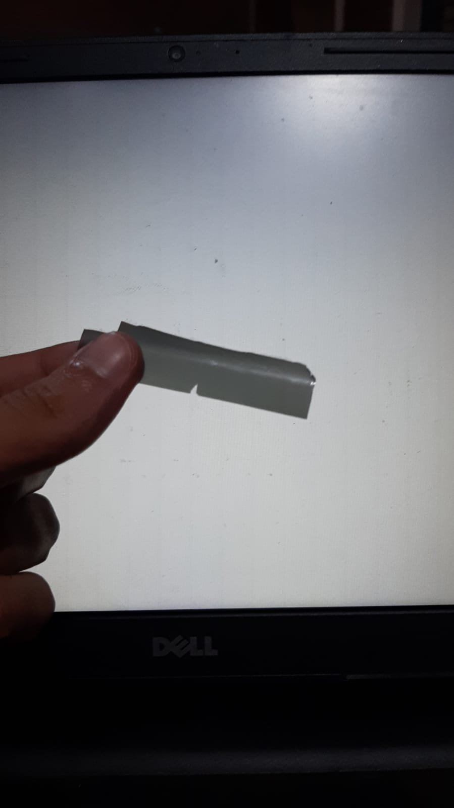
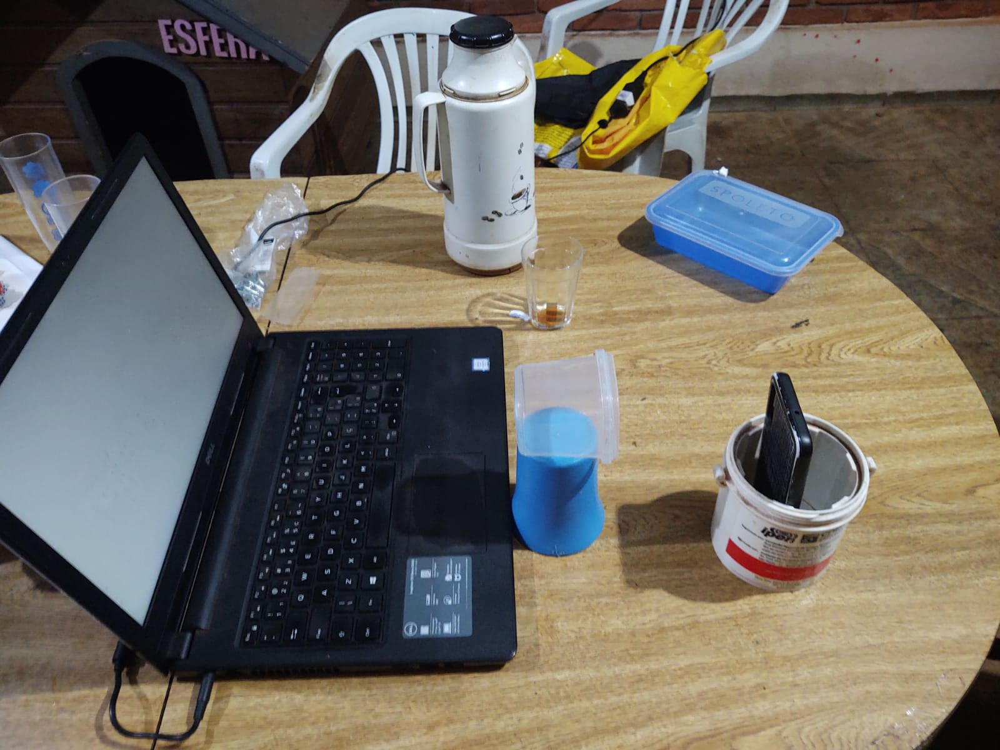
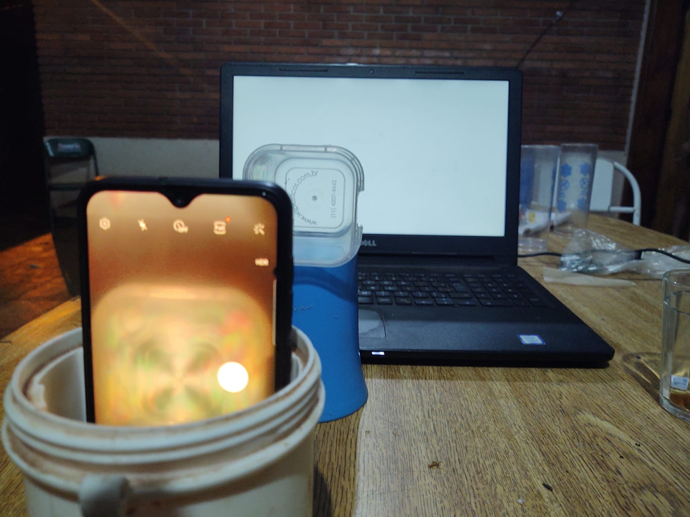

### Alunos
Carlos Manuel de Jesus Puentes Valdes **11812591**
Gabriele Silva de Freitas **11236251**

# O que esse programa faz?
A partir de uma região da imagem, vão ser buscadas regiões vizinhas de cor média mais próxima
de forma a tentar destacar regiões de cor semelhante.

O resultado estará em **out.jpeg**.

## Por que ele existe?
De forma a tentar realizar algum estudo em cima do efeito fotoelástico, foi realizada a remoção de um filtro polarizador encontrado na tela de um tablet antigo e quebrado.

Com a tela do notebook completamente branca, e o filtro posicionado na frente da câmera do celular apontada para a tela, foram tiradas as fotos que podem ser encontradas em `./images`.

Foram tiradas fotos de materiais plásticos que apresentassem o efeito isocromático quando entre a tela e o celular, no caso um copo (por dentro), um pote (por dentro) e uma tampa de pote.

### Fotos do procedimento





# Como compilar?
Para compilar, precisa ter instalado a linguagem Go.

# Como usar?
Execute o binário resultando passando como argumentos em ordem:
 - caminho da imagem
 - x inicial
 - x final
 - y inicial
 - y final
 - número máximo de iterações

**Exemplo**:
```
./main ./images/copo_cortado.jpeg 423 435 299 313 100
```
